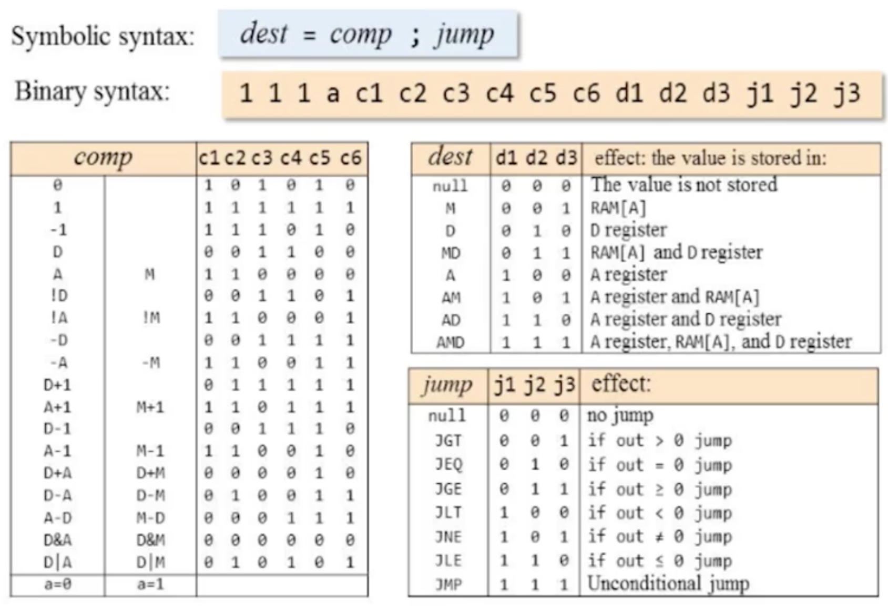

# ASSEMBLER.HACK

Assembler.hack is a 16-bit machine language assembler for the 16-bit Hack Assembly Language. This was done as part of building a complete 16-bit computer from the grounds up through the book, and [MOOC](https://www.coursera.org/learn/build-a-computer/), *Elementes of Computing Systems*, which is informally known as [nand2tetris](http://www.nand2tetris.org). Hack is also the name of the computer.

## DESCRIPTION

Assembler.hack takes a program source code file written in the Hack Assembly Language (see: [Intro to Hack Assembly Lang.](#INTRO-TO-THE-HACK-ASSEMBLY-LANGUAGE) below), which is a *.asm* text file, and then assembles it into binary machine code (Hack Machine Language). The assembled machine code program is then written to a new *.hack* text file with the same name.

The Assembling process is implemented in two passes. The first pass scans the whole program, registering the symbols (variables and labels) in the symbol table. The second pass scans the whole program again, substituting the symbols with their respective memory addresses in the symbol table, generating binary machine code and writing the assembled machine code to a new file text file with the *.hack* file extenion.

Source code is organized into several components, the decisions for their names, interfaces and APIs were already specified in the book as sort of an specification-implementation contract. All components of the Assembler reside in the */Assembler* directory, as follows:

  1. **Assebmler.py**: Main module. Implements the two passes and glues the other components together.
  2. **Parser.py**: Simple Parser. Parses the instructions by looking ahead 1 or 2 characters to determine their types and structures.
  3. **Lex.py**: A simple Lexer which is used by the Parser to break an instruction to smaller parts and sturcture it in a way that makes it easy to convert it to machine code.
  4. **Code.py**: Generates binary machine code for instructions. For C-Instructions, it generates machine code for its constituting parts and then merges them back altogether.
  5. **SymbolTable.py**: Implements a lookup table which is used to register symbols (labels and variables) and look up their memory addresses.

#### How to Use:

```bash
$ ./Assembler.py HelloWorld.asm
```

## REQUIREMENTS

  * Python 3.5.1

## EXAMPLE PROGRAM ASSEMBLY

*Note: You might need to read the Intro to Hack Assembly Lang. section below to understand the instructions in Max.asm source code.*

#### Max.asm

```x86
// Given two numbers stored in the registers R0 and R1,
// compute the maximum between them and store it in the R2 register.
  @R0
  D=M              // D = first number
  @R1
  D=D-M            // D = first number - second number
  @OUTPUT_FIRST
  D;JGT            // if D>0 (first is greater) goto output_first
  @R1
  D=M              // D = second number
  @OUTPUT_D
  0;JMP            // goto output_d

(OUTPUT_FIRST)
  @R0             
  D=M              // D = first number

(OUTPUT_D)
  @R2
  M=D              // M[2] = D (greatest number)

(INFINITE_LOOP)
  @INFINITE_LOOP
  0;JMP            // infinite loop
```

#### Max.hack

```binary
0000000000000000
1111110000010000
0000000000000001
1111010011010000
0000000000001010
1110001100000001
0000000000000001
1111110000010000
0000000000001100
1110101010000111
0000000000000000
1111110000010000
0000000000000010
1110001100001000
0000000000001110
1110101010000111
```

## INTRO TO THE HACK ASSEMBLY LANGUAGE

The Hack Assembly Language is minimal, it mainly consists of 2 types of instructions. It ignores whitespace and allows programs to declare symbols with a single symbol declaration instruction. Symbols can either be labels or variables. It also allows the programmer to write comments in the source code, for example: `// this is a single line comment`.

If you cannot contain your excitement then head over to the [tests](tests/) directory and check out the testing programs, **.asm** files contain programs written in the Hack Assembly Language, and **.hack** files contain their equivalent binary machine code programs (Hack Machine Language).

### Predefined Symbols

  * **A**: Address Register.
  * **D**: Data Register.
  * **M**: Refers to the register in Main Memory whose address is currently stored in **A**.
  * **SP**: RAM address 0.
  * **LCL**: RAM address 1.
  * **ARG**: RAM address 2.
  * **THIS**: RAM address 3.
  * **THAT**: RAM address 4.
  * **R0**-**R15**: Addresses of 16 RAM Registers, mapped from 0 to 15.
  * **SCREEN**: Base address of the Screen Map in Main Memory, which is equal to 16384.
  * **KBD**: Keyboard Register address in Main Memory, which is equal to 24576.

### Types of Instructions:

  1. A-Instructions: Addressing instructions.
  2. C-Instructions: Computation instructions.

#### A-INSTRUCTIONS:

##### Symbolic Syntax:

`@value`, where value is either a decimal non-negative number or a Symbol.

Examples:

  * `@21`
  * `@R0`
  * `@SCREEN`

##### Binary Syntax:

`0xxxxxxxxxxxxxxx`, where `x` is a bit, either 0 or 1. A-Instructions always have their MSB set to 0.

Examples:

  * `000000000001010`
  * `011111111111111`

##### Effects:

Sets the contents of the **A** register to the specified value. The value is either a non-negative number (i.e. 21) or a Symbol. If the value is a Symbol, then the contents of the **A** register is set to the value that the Symbol refers to but not the actual data in that Register or Memory Location.

#### C-INSTRUCTIONS:

##### Symbolic Syntax:

*dest* = *comp* ; *jmp*, where:

  1. *dest*: Destination register in which the result of computation will be stored.
  2. *comp*: Computation code.
  3. *jmp*: The jump directive.

Examples:
  * `D=0`
  * `M=1`
  * `D=D+1;JMP`
  * `M=M-D;JEQ`

##### Binary Syntax:

`1 1 1 a c1 c2 c3 c4 c5 c6 d1 d2 d3 j1 j2 j3`, where:

  * `111` bits: C-Instructions always begin with bits `111`.
  * `a` bit: Chooses to load the contents of either **A** register or **M** (Main Memory register addressed by **A**) into the ALU for computation.
  * Bits `c1` through `c6`: Control bits expected by the ALU to perform arithmetic or bit-wise logic operations.
  * Bits `d1` through `d3`: Specify which memory location to store the result of ALU computation into: **A**, **D** or **M**.
  * Bits `j1` through `j3`: Specify which JUMP directive to execute (either conditional or uncoditional).

##### Effects:

Performs a computation on the CPU (arithmetic or bit-wise logic) and stores it into a destination register or memory location, and then (optionally) JUMPS to an instruction memory location that is usually addressed by a value or a Symbol (label).

##### Reference:



## LICENSE

This project is licensed under the [MIT License](LICENSE).
